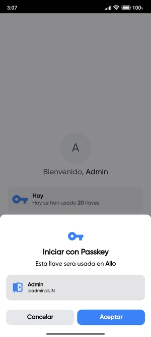

# LIN Vault

LIN Vault es una aplicación de autenticación móvil que simplifica el proceso de inicio de sesión y garantiza la seguridad de tus cuentas LIN. Nuestra aplicación permite una autenticación segura y rápida utilizando la huella digital en tus dispositivos móviles.

## Características Principales

- **Autenticación Rápida**: Inicia sesión en tus cuentas favoritas de manera rápida y sencilla utilizando tu huella digital.

- **Seguridad Reforzada**: Protege tus cuentas y datos sensibles con una capa adicional de seguridad proporcionada por la autenticación biométrica.

- **Soporte de servicios**: Todos los LIN Services puede ser iniciados con LIN Vault.

## Otras imagenes

