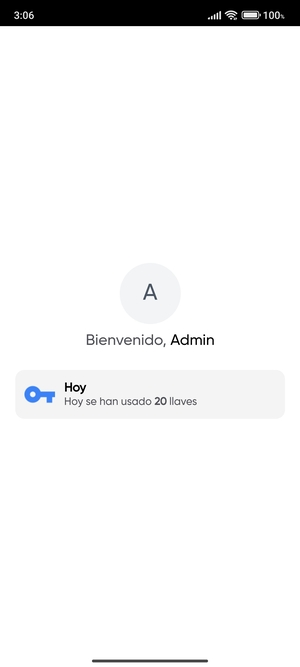

  

    
  

  
LIN Vault es una aplicación de autenticación móvil que simplifica el proceso de inicio de sesión y garantiza la seguridad de tus cuentas LIN. Nuestra aplicación permite una autenticación segura y rápida utilizando la huella digital en tus dispositivos móviles.

 

    
  

# LIN Vault

## Características Principales

- **Autenticación Rápida**: Inicia sesión en tus cuentas favoritas de manera rápida y sencilla utilizando tu huella digital.

- **Seguridad Reforzada**: Protege tus cuentas y datos sensibles con una capa adicional de seguridad proporcionada por la autenticación biométrica.

- **Soporte de servicios**: Todos los LIN Services puede ser iniciados con LIN Vault.

- 
## Tecnologías

- .NET 8.
- MAUI & Blazor Hybrid App.
- HTML, CSS y JavaScript.
- Tailwind CSS.

## Otras imagenes

# Código Fuente

Puedes revisar el código fuente de LIN Inventory, sin embargo no puedes realizar ninguna bifurcación al mismo o venderlo.

# Soporte

Para soporte, correo giraldojhong4@gmail.com

